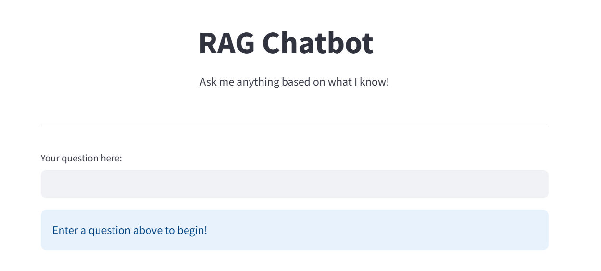
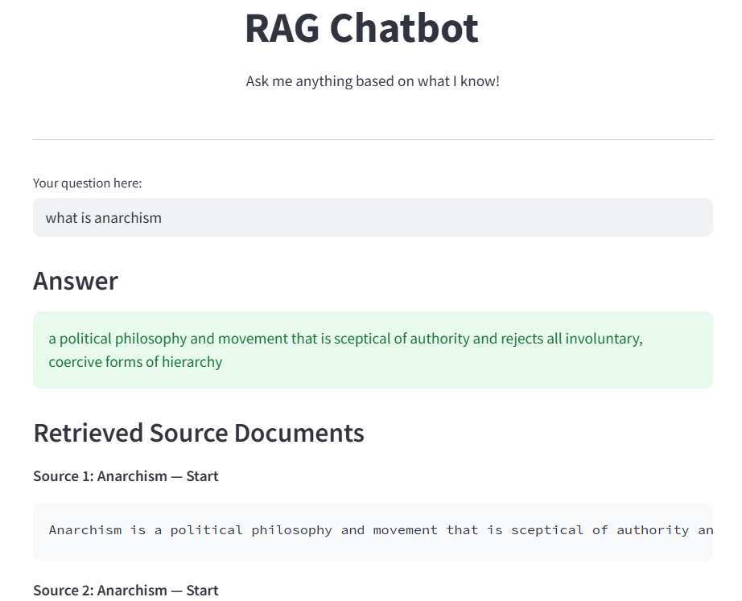

# RAG Chatbot

A Retrieval-Augmented Generation (RAG) chatbot that combines semantic search with a local language model to provide fact-grounded answers from Wikipedia. Built using **LangChain**, **FAISS**, **Sentence Transformers**, and **Flan-T5**, and deployed via **Streamlit Cloud**.

[Try the Live App](https://rag-chatbot-eqpr5xkpfsmf5m4c4plabw.streamlit.app/)

---

## Features

- **Retrieval-Augmented Generation**  
  Combines dense vector retrieval (FAISS) with local generation (Flan-T5) for contextual answers.

- **LLM-powered Q&A**  
  Uses `google/flan-t5-base` or `flan-t5-large` for instruction-tuned text generation.

- **Wikipedia Knowledge Base**  
  Answers questions using chunks retrieved from the `wiki_snippets` dataset.

- **Streamlit UI**  
  Interactive, clean web interface for real-time question answering.

- **Hallucination Guard**  
  Returns a friendly fallback message if the system can't answer accurately.

---

## Tech Stack

| Component              | Tool / Library                     |
|------------------------|------------------------------------|
| Embeddings             | `all-MiniLM-L6-v2` (sentence-transformers) |
| Vector Store           | FAISS (via LangChain)              |
| Language Model         | `google/flan-t5-large`             |
| Retrieval + QA Chain   | LangChain                          |
| Interface              | Streamlit                          |
| Dataset                | HuggingFace `wiki_snippets`        |

---

## How It Works

1. **Chunk**: Wikipedia passages are split into ~500-character chunks with overlap.
2. **Embed**: Each chunk is converted to a dense vector using MiniLM.
3. **Index**: Vectors are stored and searched with FAISS.
4. **Retrieve**: Relevant chunks are retrieved based on your query.
5. **Generate**: Flan-T5 uses the chunks to generate a grounded answer.

---

## Example Questions to Try
- What is anarchism?
- What are the core principles of anarchism?
- What was Abraham Lincoln’s policy on Native Americans?
- What are the natural wonders of Alabama?
- What is the origin of the name Alabama?

## Limitations
- Answers only questions based on the Wikipedia subset used (≈500 chunks).
- Doesn’t support live Wikipedia search or full internet queries.
- On Streamlit Cloud, initial load may be slow due to model download.

---

## Screenshots of UI
- Due to heavy model loading, or due the app going to sleep, the deployed link might be delayed in showing the ouput.
- Here are some screenshots attached to show how the UI looks like

### Initial Model Setup

---

### When the model knows the answer

---

### When the model does not know the answer

